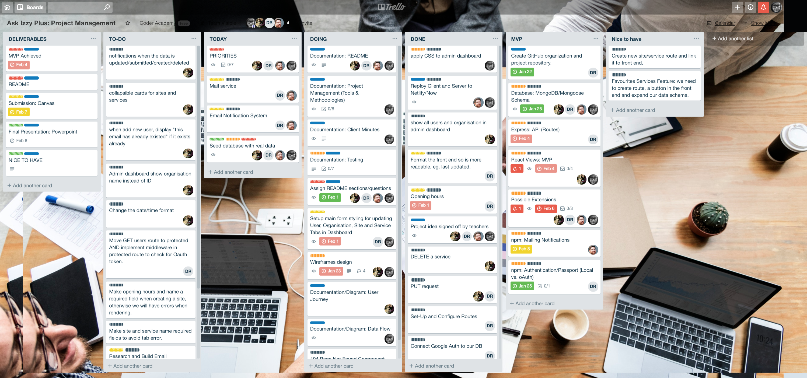

# Ask Izzy Plus <!-- omit in toc -->
Ask Izzy Plus is self-service application for service providers listed on Ask Izzy to update their contact details with our client Infoxchange. Built in the JavaScript MERN stack for our final Coder Academy group project.

[](https://ask-izzy-plus.netlify.com/)

## Ask Izzy Plus Links
### Deployed <!-- omit in toc --> 
* Client: https://ask-izzy-plus.netlify.com
* Server: https://ask-izzy.now.sh/

### GitHub Repositories <!-- omit in toc --> 
* Client: https://github.com/nodebusters/ask-izzy-plus-client
* Server: https://github.com/nodebusters/ask-izzy-plus-server

## Summary <!-- omit in toc -->
Ask Izzy Plus is a self-service application built to our client Infoxchange's specifications to allow service providers listed on Infoxchange's Ask Izzy platform to update organisation, site and service contact details. Built using JavaScript and the MERN stack (**M**ongoDB, **E**xpress, **R**eact and **N**ode.js) for our final Coder Academy project.

## Contributors <!-- omit in toc --> 

[](https://github.com/nodebusters/)

|[](https://github.com/DiegoRodriguez2018)| [](https://github.com/Aitzu) | [](https://github.com/linda-lai)| [](https://github.com/omegadefender) 
|-----------|-----------|-------------| ------------- |
| Diego Rodriguez | Aitzu Hu | Linda Lai | James Hastings |

## Contents <!-- omit in toc -->
- [Ask Izzy Plus Links](#ask-izzy-plus-links)
- [About Ask Izzy Plus](#about-ask-izzy-plus)
  - [Project Background](#project-background)
  - [Functionality and Features](#functionality-and-features)
- [Screenshots (Live Application)](#screenshots-live-application)
- [The Brief](#the-brief)
  - [The Client](#the-client)
  - [The Problem (Problem Definition)](#the-problem-problem-definition)
  - [The Solution (Purpose)](#the-solution-purpose)
- [Application Design](#application-design)
  - [Design Process](#design-process)
  - [User Stories](#user-stories)
  - [Workflow Diagram: User Journeys](#workflow-diagram-user-journeys)
  - [Wireframes](#wireframes)
  - [Database Schema](#database-schema)
  - [Data Flow Diagram](#data-flow-diagram)
  - [OO Design Documentation](#oo-design-documentation)
- [Project Management & Planning](#project-management--planning)
  - [Project Plan and Timeline](#project-plan-and-timeline)
  - [Team Communication](#team-communication)
  - [Client Communications](#client-communications)
- [Tools & Methodologies](#tools--methodologies)
  - [Task Management](#task-management)
  - [Design Tools](#design-tools)
  - [Source Control](#source-control)
    - [Github and Gitflow](#github-and-gitflow)
  - [Agile Methodologies](#agile-methodologies)
  - [Code Review](#code-review)
  - [Deployment](#deployment)
  - [Testing](#testing)
- [Short Answers: Post-Review](#short-answers-post-review)
  - [Q1: What are the most important aspects of quality software?](#q1-what-are-the-most-important-aspects-of-quality-software)
  - [Q2: What libraries are being used in the app and why?](#q2-what-libraries-are-being-used-in-the-app-and-why)
    - [Client Side:](#client-side)
    - [Server Side:](#server-side)
  - [Q3: A team is about to engage in a project, developing a website for a small business. What knowledge and skills would they need in order to develop the project?](#q3-a-team-is-about-to-engage-in-a-project-developing-a-website-for-a-small-business-what-knowledge-and-skills-would-they-need-in-order-to-develop-the-project)
  - [Q4: Within your own project what knowledge or skills were required to complete your project, and overcome challenges?](#q4-within-your-own-project-what-knowledge-or-skills-were-required-to-complete-your-project-and-overcome-challenges)
  - [Q5: Evaluate how effective your knowledge and skills were this project, using examples, and suggest changes or improvements for future projects of a similar nature?](#q5-evaluate-how-effective-your-knowledge-and-skills-were-this-project-using-examples-and-suggest-changes-or-improvements-for-future-projects-of-a-similar-nature)
- [Future Development](#future-development)
  - [Extensions](#extensions)
  - [Handover](#handover)
  - [Client Survey/Questionnaire](#client-surveyquestionnaire)
  - [Running Ask Izzy+ (Developers)](#running-ask-izzy-developers)
- [Presentation](#presentation)

<!-- TODO: LINDA -->
## About Ask Izzy Plus
### Project Background
Tasked with finding a real world customer to design, build, deploy and present a web application for our final Coder Academy project, Ask Izzy Plus is a self-service application built in JavaScript using the MERN stack to our client Infoxchange's requirements. 

The scope of our project for the MVP was to build a working prototype/proof of concept application for our client to pilot with a sample of Ask Izzy service providers as part of Infoxchange's broader Ask Izzy Plus project. To this end, simplifying the process for service providers to update their information with Infoxchange, and enabling service providers to update their details via a self-service application was a key pain point/wishlist identified by Infoxchange.

After finding our client, we met and worked with Ask Izzy's product manager to understand their current challenges and suggest ideas for a custom web application to solve a particular problem or area of this pain point. For the initial MVP, creating a prototype self-service application to allow service providers to update organisation, site and service information was the end goal. Integrating this functionality directly into the core Ask Izzy ecosystem was beyond the scope of this project so we created our own document database aligned as closely as possible to Infoxchange's data structure. From there, we worked to design and deploy a complete MVP over a three-week period written using the JavaScript MERN stack (**M**ongoDB, **E**xpress, **R**eact and **N**ode.js), and other node packages.

<!-- TODO: LINDA -->
### Functionality and Features
[Ask Izzy Plus](https://ask-izzy-plus.netlify.com) is a supplementary self-service application for service providers listed on Infoxchange's flagship [Ask Izzy](https://askizzy.org.au) platform, a mobile website that helps people who are homeless or at risk of becoming homeless to find essential services they need nearby and now.
* Using Ask Izzy Plus, service providers from Ask Izzy that have been whitelisted to use the platform by admins can login/logout and view contact details structured at multiple levels (organisation, site and services), in line with the data structure of the Infoxchange's Service Seeker database (which supports a number of directory services provided by Infoxchange, including Ask Izzy).
* From there, service providers can create, read, update and delete details for the organisation, sites and services they have been associated with. Users are associated with a particular organisation (which contain multiple sites and associated services with each site) by admins when onboarded that determine which organisation, sites and services they can view and edit.
* In turn, admin users (i.e. Nodebusters or Infoxchange) are responsible for pre-qualifying and onboarding service provider users onto Ask Izzy Plus first by whitelisting authorised email addresses and associating authorised users with a particular organisation. Admins can view all whitelisted users and whitelist a new user to an organisation in the admin dashboard.
* Our Ask Izzy Plus prototype uses Google OAuth to handle all user logins and manage authentication via a third-party provider.

<!-- TODO: LINDA -->
## Screenshots (Live Application)
<!-- FIXME: Add Final Screenshots -->
|[]() | []() |
|-----------|-----------|
 | |

--- PLACEHOLDER: TO BE REPLACED WITH FINAL VERSION ---

<!-- TODO: LINDA -->
## The Brief
### The Client

**Infoxchange**

Our client, [Infoxchange](https://www.infoxchange.org/au/ask-izzy), is a not-for-profit social enterprise/non-government organisation that develops and supports software for a wide range of purposes to help support people who face disadvantage and the community organisations that support them. Infoxchange's Service Seeker database is Australia's largest up-to-date directory of health and welfare services, powering its sister directory Ask Izzy, the product we were supporting for our project brief.

**Ask Izzy**

Infoxchange's mobile website Ask Izzy is a centralised directory that provides a broad range of location and service-based search for people at risk of or experiencing homelessness or disadvantage to service providers across Australia. Users can find out about location based housing options, where to access meals, material aid and health services and local services including legal, financial, alcohol and other drugs, family violence and mental health. 

Designed mobile-first, and free and anonymous to use, Ask Izzy is compatible across desktop, tablet and mobile and connects close to 1000 people a day to help nearby, with its primary users being people who face disadvantage or risk, and staff working in organisations that support them.

Infoxchange's Ask Izzy is an open source application and can be located on GitHub: https://github.com/ask-izzy/ask-izzy.

<!-- TODO: LINDA -->
### The Problem (Problem Definition)
With over 360,000 service providers listed across Australia and close to 1,000 people a day connecting to Ask Izzy, accuracy of services available and up-to-date information is hugely important to clients using these services and vital to keeping Ask Izzy relevant. Infoxchange policy requires that direct contact be made with service providers prior to adding or updating records to comply with privacy laws, confirm that changes were submitted by the service provider's office and verify the validity, accuracy and completeness of the information.

Infoxchange employs several updating methods (scheduled bulk auto-emails, self-responses via online forms, mail-outs, telephone and fax-backs), with a week's turnaround on change requests and phone contact proving itself the most effective updating method. Currently, if service details need to be updated or removed from the Ask Izzy and Infoxchange Service Seeker directly, users must click on the Feedback/Report an Error link on the individual service listing and provide all of the requested information.

To this end, simplifying the process for service providers to update their information, and enabling service providers to access a self-service functionality served as the basis for our prototype MVP.

<!-- TODO: LINDA -->
### The Solution (Purpose)
> “Everyone wears different hats depending on the day.”

> “The System should be a funnel, instead it’s a colander.”

With the goal of the exploring the needs of staff working in organisations that use Ask Izzy to find out what additional functionality would make it useful to them, the Ask Izzy Plus project team at Infoxchange identified some key insights and challenges through recent user research (one-on-one interviews with service providers working in the not for profit sector and with people who have experienced homelessness) that served the basis for our prototype MVP, namely:


* Service providers need to be able to update their service details.
* The process needs to be simplified for service providers to update their information.
* Accuracy of services available are important to clients using these services.
* Service providers would like to be able to login to/logout of a user dashboard and update their details and information on Ask Izzy easily.

Our brief from Infoxchange entailed creating a working prototype/proof of concept web application called Ask Izzy Plus, a supplementary self-service application to Ask Izzy, to enable service providers to login/logout of a user dashboard, view, create, delete and update contact information about their organisation and its site and services, and send an alert to Infoxchange of any changes to improve current data maintenance methods.

Our prototype will be used by Infoxchange to pilot with a sample of Ask Izzy service providers as part of Infoxchange's broader Ask Izzy Plus project.

Possible extensions discussed with our client during this ideation stage for the Ask Izzy Plus self-service app prototype included:
* Create Favourites lists of services that could easily be shared with clients via hardcopy, SMS or email;
* Update vacancy details if they provide crisis/short-term accommodation and for vacancy status to be displayed on their service page.
* View feedback from clients on their services.
* Ability to get push updates or notifications (such as weather warnings that might impact clients/rough sleepers).

## Application Design
```
Demonstrate your ability to break down the problem and design a solution.
- Compose a summary of your application including problem definition and solution
- Review the conceptual design with the client and edit based on their feedback
- User stories for the whole application
- A workflow diagram of the user journey/s
- Wireframes for all main pages of your app
- Entity Relationship Diagram (ERD)
- Project plan and effort estimation
- Data Flow Diagram
- OO design documentation
```

<!-- TODO: LINDA -->
### Design Process
After receiving an initial brief and researching Ask Izzy's existing UX/UI we met with our client Sam, Ask Izzy's product manager in person to discuss and confirm business, design and technical requirements. Sam gave us an overview of the scope and intended use of the app (namely, a working prototype to pilot with a sample of Ask Izzy service providers), and the core functionality and design of the MVP: a self-service application to allow Ask Izzy service providers to view and update organisation, site and service details.

Integrating this functionality into the existing main Ask Izzy platform was beyond the scope of our project; being a prototype for our client, this meant we could create our own database. However, we endeavoured to align our document database as closely as possible to Infoxchange's relational database structure. For branding and design consistency, Sam suggested and we agreed that the Ask Izzy Plus app should mimick the layout and design elements of Infoxchange's Ask Izzy UI, and be compatible with mobile, tablet and desktop.

From there, throughout the project we provided Sam with periodic updates regarding the status of the project or followed up with her to query and confirm any follow up questions or open items from our initial meeting.

<!-- TODO: Linda -->
### User Stories
Following Agile methodologies, user stories were written up in Trello to guide the development of our MVP from the perspective of our core Ask Izzy Plus end users to capture a description of our software features from their perspective: users (service providers) and admin (Infoxchange).

This pushed us to provide a high level definition of a requirement to create a simplified description, and helped to break down the features and functionality of the MVP early on.


<!-- FIXME: AITZU -->
### Workflow Diagram: User Journeys
-- INSERT DIAGRAM --
A workflow diagram of the user journeys

<!-- FIXME: AITZU -->
### Wireframes
-- INSERT WIREFRAMES --
Continuing with our UX/UI design documentation, we used Figma to create our wireframes for our application, and map out Ask Izzy's brand colours, typography, assets to develop the visual identity for Ask Izzy Plus.

Mimicking the general UI layout of the core Ask Izzy platform in our MVP had multiple advantages: along with consistency in UX, the UI itself lends itself well to responsive design, accessability and readability.


<!-- TODO: Linda -->
### Database Schema
Infoxchange's Service Seeker platform uses a relational database with information structured at multiple levels, namely:
* Organisation (which can contain multiple Sites)
* Site (which can supply multiple Services at a single Site)
* Service (a single service that a Site offers or an individual Practitioner)

While the prototype Ask Izzy Plus application uses a different database both in terms of structure (a document rather than a relational database) and storage (MongoDB instead of an SQL database), we endevoured to align our database as closely as possible to Infoxchange's existing Service Seeker database, based on documentation and data samples provided to us during the briefing process.

Given the numerous information fields associated with a single organisation, site and service, and the nested nature of the database models, this stage proved to be one of the trickiest elements to reconcile.

Based on Infoxchange's information hierarchy, the following MongoDB collections/schemas were created for Ask Izzy Plus: `User`, `AdminUser`, `Service` (nested as an array within `Site`), `Site` (nested as an array within `Organisation`) and `Organisation`.
* `Organisation`: An Organisation represents a single auspicing group or body responsible for sites providing services.
* `Site`: A Site represents a physical location, or alternatively a mobile unit with a catchment.
* `Service`: A Service represents a single service that a site offers; services offered at multiple sites will have different service records per site. Alternatively, a Practitioner (an individual that should be listed as a referral endpoint) can also be listed as a Service; individuals working at multiple sites will have different records.
  
  ```js
    const serviceSchema = new Schema({
        id: String // auto-generated by Mongoose
        name: String,
        description: String,
        referralInfo: String,
        adhcEligible: Boolean,
        assessmentCriteria: String,
        targetGender: String,
        availability: String,
        billingMethod: String,
        cost: String,
        crisisKeywords: String,
        details: String,
        eligibilityInfo: String,
        ineligibilityInfo: String,
        fundingBody: String,
        healthcareCardHolders: Boolean,
        intakeInfo: String,
        intakePoint: String,
        isBulkBilling: Boolean,
        ndisApproved: Boolean,
        promotedService: Boolean,
        specialRequirements: String,
        language: String,
        ageGroupKeyword: String,
        ageGroupDescription: String,
        serviceTypes: String,
        indigenousClassification: String,
        capacityStatus: String,
        capacityStatusText: String,
        capacityFrequency: String,
        capacityLastNotification: String,
        capacityLastStatusUpdate: String,
        capacityExpireDate: String,
        accreditationName: String,
    });

    const openingHoursSchema = new Schema({
        id: String // auto-generated by Mongoose
        day:String,
        openTime:String,
        closeTime:String,
        openingHoursNote: String,
    })

    const siteSchema = new Schema({
        id: String // auto-generated by Mongoose
        name: String,
        accessibility: String,
        locationDetails: String,
        parkingInfo: String,
        publicTransportInfo: String,
        isMobile: Boolean,
        emailAddress: String,
        emailIsConfidential: Boolean,
        website: String,
        postalAddress: String,
        postalAddressState: String,
        postalAddressSuburb: String,
        postalAddressPostcode: String,
        postalAddressIsConfidential: Boolean,
        phoneNumber: String,
        phoneKind: String,
        phoneIsConfidential: Boolean,
        openingHours: [openingHoursSchema],
        addressBuilding: String,
        addressLevel: String,
        addressFlatUnit: String,
        addressStreetNumber: String,
        addressStreetName: String,
        addressStreetType: String,
        addressStreetSuffix: String,
        addressSuburb: String,
        addressState: String,
        addressPostcode: String,
        addressIsConfidential: Boolean,
        servicesInSite: [serviceSchema],
    });

    const organisationSchema = new Schema({
        id: String // auto-generated by Mongoose
        name: String,
        description: String,
        createdAt: Date,
        lastUpdated: Date,
        website: String,
        abn: String,
        providerType: String,
        alsoKnownAs: String,
        emailAddress: String,
        emailIsConfidential: Boolean,
        postalAddress: String,
        postalAddressState: String,
        postalAddressSuburb: String,
        postalAddressPostcode: String,
        postalAddressIsConfidential: Boolean,
        phoneNumber: String,
        phoneKind: String,
        phoneIsConfidential: Boolean,
        ceo: String,
        sitesInOrganisation: [siteSchema],
    });
    ```

* `User`: A user from an Ask Izzy service provider.
    ```js
    const userSchema = new Schema({
        email: String,
        organisation:{type: mongoose.Schema.Types.ObjectId, ref: 'Organisation'}
    });
    ```

* `Admin User`: An admin user for Ask Izzy Plus from Infoxchange.
    ```js
    const AdminUserSchema = new Schema({
        email: String,
        firstName: String,
        lastName: String
    });
    ```

<!-- TODO: LINDA -->
### Data Flow Diagram
Because of the adaptability and flexibility of the MERN software stack(**M**ongoDB, **E**xpress, **R**eact and **N**ode.js), along with other client, server and database npm packages like Axios, Nodemailer and Mongoose, we were able to scaffold a prototype for Ask Izzy Plus, with the overall data flow represented below:


<!-- TODO: LINDA -->
### OO Design Documentation
When considering OO design and class attributes, methods and relationships, our main consideration was representing people (users) and locations (organisations, sites and services), and the relationship between them: our document database has three collections, `AdminUser`, `User` and `Organisation`, with arrays of `Sites` and `Services` embedded across three levels in the Organisation collection.

For the prototype it was preferred that authentication be handled by a third party, for which we implemented Google OAuth using Passport, an npm package. As the admin user, our client can create a new user (service provider) by whitelisting a Google email address and associating them with an organisation, view all users and delete users from the admin dashboard.
From the service provider portal, whitelisted users can create, read, update and delete locations and update their information and contact details. An update from the current record in our database will trigger a mailer notification to admin (Infoxchange's support team) that an update is required.

The Ask Izzy Plus client uses Axios to query the User/AdminUser and Organisation collections in the MongoDB database and iterative logic to display the nested arrays of Sites and Services embedded within the Organisation collection.


## Project Management & Planning
```
Handover:
- Manage system testing and hand over activities. Prepare maintenance or support plans for client
- Obtain final project sign-off
- As a team, conduct post project review
- Create a questionnaire for the client to ascertain the satisfaction with your products and services
```
### Project Plan and Timeline

To manage the project and keep track of tasks and communications within the team and with our client in the day-to-day and for documentation purposes we used Trello, Slack, Google Docs, Google Sheets and email to delegate tasks and have a single source of truth and line of communication, this informed our Git and code review processes.


<!-- TODO: LINDA -->
### Team Communication
After collaborating on an initial brief with our client to use as a project charter, with a preliminary statement of project scope to obtain initial sign-off, our planning methodology involved:

* Allocating roles and responsibilities to team members, based on project solution requirements and monitor each other's assigned work using Trello and GitHub Organisations.
* Preparing a work breakdown and schedule of key milestones in Google Sheets.
* Monitoring client and team communications via email and Slack, using Google Docs to record minutes, reassess ongoing project scope changes, risks, blockers and issues.
  
  

<!-- FIXME: LINDA -->
### Client Communications
With product manager Sam coming from a software development background, managing expectations and communications with our client was extremely straightforward and clear. Since the finished app will be used as a prototype, we felt assured by the fact there would
ultimately be some kind of business use for it while also being able to deliver an MVP in three weeks.

We were particularly keen and pleased to work with a non-for-profit organisation, and surprised to discover that Ask Izzy is an open source project on GitHub.

After our initial in person meeting with Sam and Claire from Infoxchange, we had one further follow up and stayed in touch with feedback and questions via email and keeping track of the minutes in Google Sheets

* Client Minutes
  
  

* Gmail
  
  

<!-- TODO: DIEGO -->
## Tools & Methodologies
### Task Management
Using Trello as our primary project management tool to enforce Agile and Scrum workflow processes, allocate and categorise tasks and have a single source of truth to monitor what each of us were currently working on, we could evalulate our progress throughout the project by seeing all current tasks and blockers visually, creating lists under the following:
* `DELIVERABLES`
* `TO DO`
* `TODAY`
* `DOING`
* `DONE`
* `MVP`
* `NICE TO HAVE`

In the planning stage, we broke down the MVP functionality and features based on the user stories, adding more as new tasks and bugs opened up, and relocating cards into the relevant columns each day. We also took advantage of the calendar tool in order to keep track of important deadlines and to allocate each new task to a team member right away so it was always clear what each of us were working on.



### Design Tools
For designing and editing assets, wireframing and diagramming for this project, Figma and Balsamiq were used to quickly ideate a mock up, create assets for the app and README, and create a mood board for Infoxchange's Ask Izzy branding and UI:


<!-- TODO: DIEGO -->
### Source Control
#### Github and Gitflow
We decided to create a GitHub Organisation with the objective of having all members as owners of the repository. The main advantage of this approach is that we can optimise production processes as under this setup any team member is able to code review and merge pull requests. Nevertheless, we decided also that if a team member creates a pull request she/he will not merge the pull request herself/himself but instead another team member will be responsible of code review and potentially merging that branch. 

As an organisation we also agreed to work in well named branches, and always push the branch instead of master in order to raise well documented pull requests. 

<!-- TODO: DIEGO -->
### Agile Methodologies
We implemented several agile methodologies during the planning and execution of the project. As an organisation we decided to distribute the responsibilities of a scrum master among all the team members.

We also performed daily standups where we discussed in a brief way how all the different parts of the project were developing and how the project as whole was being implemented.

From the beginning we focused in working software and customer collaboration. We aimed to have a conversation with the customer as the project was developing. For us customer satisfaction was the main priority and we aimed to adapt accordingly to the customer requirements.

Sustainable development and simplicity were also very important for us. During the planning process we agreed in setting realistic goals with a good buffer in case of unexpected issues. Likewise, we agreed on pursuing the satisfaction of our customer requirements in the simplest way possible.

Another important technique we implemented in the initial stages of the project was pair programming. This was very helpful to get all the team members in the same page in terms of database design and application flow. 

<!-- TODO: DIEGO -->
### Code Review
As mention before we decided that team members were not allowed to merge their own pull request, but instead another team member is responsible for code review and merging if appropriate. 

This approach worked really well as it allowed us to pick up issues early in the development process. Occasionally we had conflicts but we were able to resolve them relatively quickly. The conflict solving process was as follows:

1. Fetch the branch to be merged locally. 
2. Pull the latest version of master locally.
3. Merge master to the branch to be merged. 
4. Code review an solve conflicts as required. 
5. Push the branch now we the conflicts solved. 

<!-- TODO: DIEGO -->
### Deployment
We decided to use a distributed deployment approach for this project with the following set up:

**Client Side: Netlify**

The client side of the application was deployed using Netlify continuous deployment. Netlify GUI was utilized to manage environmental variables and build processes. 

**Server Side: Now**

The server side of the application was deployed in now.sh, and a now.json file was used to manage environment variables and build processes. 

**Database: mLab**

The database of the application was stored in a mLab sandbox database.    

<!-- TODO: DIEGO -->
### Testing
Testing was performed often during the development of the application. Testing techniques included the following:

* Console logging variables both in the back and front end in order to check that the values are as expected. 
* Test new features in new git branches and check if they perform as expected in localhost before deploying. 
* Using Postman to confirm the server routes are receiving and sending the right information.
* Testing the production version of the application by performing a diverse range of processes live. 

## Short Answers: Post-Review
<!-- FIXME: LINDA -->
### Q1: What are the most important aspects of quality software?
1. For the end-user (customer)
2. For the developer/business (client)

* Functional Components
* Reusability
* Composition
* DRY - don't repeat yourself: Demonstrate DRY principles in all code.
* Separation of concerns: separate your program into modules that each deal with one particular focus, or concern.

<!-- FIXME: DIEGO -->
### Q2: What libraries are being used in the app and why?
#### Client Side:
* axios@0.18.0: To perform promise based HTTP requests
* history@4.7.2: To redirect pages programmatically in react. 
* jwt-decode@2.2.0: To decode jwt tokens.
* react@16.7.0: To produce view/controller components of our application. 
* react-confirm-alert@2.1.0: To handle confirm dialogs. 
* react-dom@16.7.0: To interact with the DOM.
* react-google-login@5.0.0: To handle google OAuth process. 
* react-router-dom@4.3.1: To load components in different routes. 
* react-scripts@2.1.3: To configure scripts for create-react-app.
* react-tabs@3.0.0: To easily create tab components. 

#### Server Side:
* cookie-parser@1.4.3: To parse cookies with signatures. 
* cookie-session@2.0.0-beta.3: To configure and manage sessions. 
* cors@2.8.5: To enable cors in the server. 
* dotenv@6.2.0: To have access to environment variables.
* express@4.16.4: To configure and develop the app API. 
* jwt-decode@2.2.0: To decode jwt tokens.
* mongoose@5.4.6: To interact with MongoDB database. 
* nodemailer@5.1.1: To send emails from node. 
* nodemon@1.18.9: To To monitor the performance of the API during development.
* now@13.1.2: To deploy the server in now.sh
* nodemailer@5.1.1: To send emails from node. 
* passport@0.4.0: To deal with authentication in node. 
* passport-google-oauth@1.0.0: To handle google OAuth strategy. 

<!-- FIXME: ??? -->
### Q3: A team is about to engage in a project, developing a website for a small business. What knowledge and skills would they need in order to develop the project?
* Business Context

<!-- FIXME: ??? -->
### Q4: Within your own project what knowledge or skills were required to complete your project, and overcome challenges?
* Knowledge
* Skills
* Challenges

<!-- FIXME: ??? -->
### Q5: Evaluate how effective your knowledge and skills were this project, using examples, and suggest changes or improvements for future projects of a similar nature?
* Effectiveness - Strengths and Weaknesses
* Learnings, Future Lessons

## Future Development
<!-- FIXME: JAMES -->
### Extensions
<!-- FIXME: JAMES -->
### Handover
### Client Survey/Questionnaire
<!-- FIXME: DIEGO -->
### Running Ask Izzy+ (Developers)
Developer instructions for running Ask Izzy Plus can be found here: https://github.com/nodebusters/ask-izzy-plus-client/blob/master/README_dev.md

<!-- FIXME: GROUP -->
## Presentation
You are to deliver a 7 minute presentation to the class.

The presentation should include,

* A walk-through of your live App website and its features
* A walk-through of your design process and decisions
* A review of your development/build process including challenges, ethical issues, favourite parts, etc
* Answer questions from the audience
* Use this presentation as an opportunity to pitch your ideas to 'investors'.